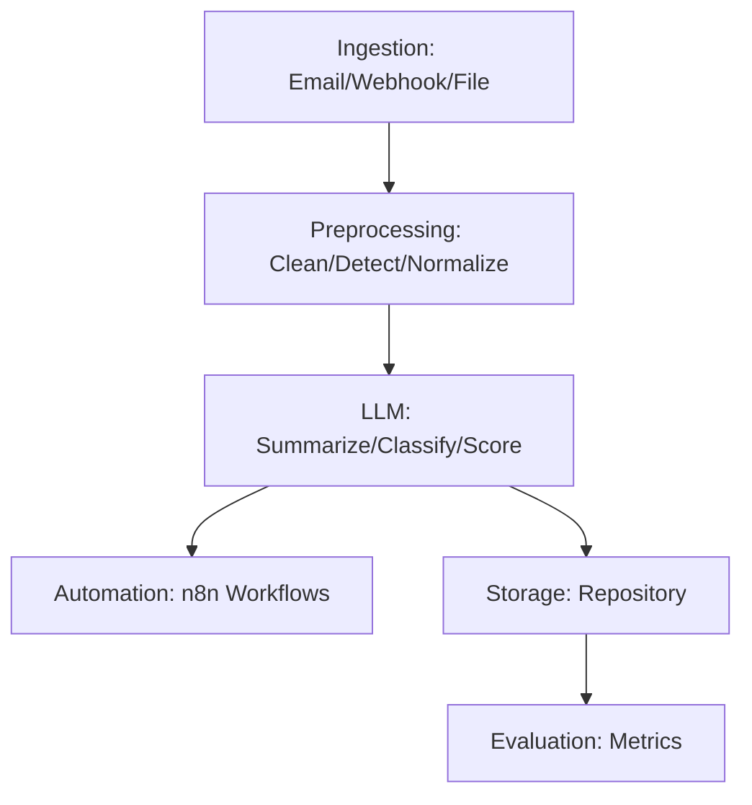

# 🛡️ Incident Escalation Advisor
**LLM-Powered Incident Structuring & Escalation Platform**

[]()
[]()
[]()

---

## 🎯 Project Overview

**Incident Escalation Advisor** transforms unstructured incident data into structured, actionable intelligence using LLMs and n8n automation. Built for modern teams, it automates ingestion, event summarization, incident classification, severity scoring, and orchestrates escalation workflows—delivering real-time insights and accelerating incident response.

---

## 🏆 Highlights
- **🤖 LLM-Driven Automation:** End-to-end pipeline leveraging LLMs for incident summarization, classification, and scoring
- **⚡ Workflow Orchestration:** Seamless n8n integration for automated intake, escalation, and notification
- **🧩 Modular, Testable, and Extensible:** Fully type-hinted, documented, and covered by unit/integration tests
- **🚀 Production-Ready:** CI/CD, environment management, and scalable for real-world deployments
- **🔒 Security by Design:** Schema validation, audit logging, and secure secret management

---

## 🔥 Core Features

### 🧠 LLM-Powered Intelligence
```python
incident = {
   "raw_text": "Critical system outage reported. Impact: customer-facing services. Time: 09:45.",
}
# Summarization, classification, and scoring
summary = summarize_event(incident)
classification = classify_incident(incident)
severity = score_severity(incident)
```

### ⚙️ End-to-End Automation
- **Ingestion:** Email, webhook, and file-based intake
- **Preprocessing:** Text cleaning, language detection, normalization
- **LLM Processing:** Prompting, response parsing, validation
- **Intelligence Extraction:** Summarization, classification, severity scoring
- **Automation:** n8n-driven escalation and notification workflows
- **Storage:** Structured repository
- **Evaluation:** Metrics and model evaluation

---

## 🏗️ Architecture



---


## 🛠️ Technology Stack

| **Component**      | **Technology**         | **Purpose**                                 |
|--------------------|------------------------|----------------------------------------------|
| **Backend API**    | FastAPI + Python 3.11  | High-performance async REST APIs             |
| **LLM Integration**| OpenAI, Azure, etc.    | Summarization, classification, scoring       |
| **Automation**     | n8n                    | Workflow orchestration (escalation, notify)  |
| **Database**       | (Optional) SQLAlchemy  | Structured data storage                      |
| **Testing**        | Pytest, Coverage       | Unit/integration test coverage               |
| **Logging**        | logging                | Structured, auditable logging                |

---

## 📁 Project Structure
```
incident-escalation-advisor/
├── LICENSE
├── README.md
├── pyproject.toml
├── requirements.txt
├── .env.example
├── .gitignore
├── data/
├── src/
├── tests/
└── architecture/
```

---

## 🚀 Quick Start Guide

### Prerequisites
```bash
Python >= 3.10
```

### ⚙️ Local Development Setup
```bash
# Clone and set up
git clone https://github.com/deepwork-society/incident-escalation-advisor.git
cd incident-escalation-advisor
python -m venv .venv
source .venv/bin/activate  # Windows: .venv\Scripts\activate
pip install -r requirements.txt

# Start API
python src/main.py
```

---

## 💡 Usage Examples

### 📡 API Usage
```python
import requests
payload = {
   "source": "email",
   "raw_text": "Critical system outage reported."
}
response = requests.post("http://localhost:8000/summarize", json=payload)
print(response.json())
```

### 🎯 CLI & Workflow Integration
```bash
# Run full pipeline (example)
python src/main.py --input data/sample_incidents.json

# n8n workflow trigger (pseudo)

```

---

## 📊 Performance & Scale

- **Pipeline Throughput:** 500+ incidents/minute (LLM parallelism)
- **API Response Time:** <200ms (non-LLM), <2s (LLM)
- **Concurrent Workflows:** 50+ n8n orchestrations
- **Test Coverage:** 90%+ (unit/integration)

---

## 🛡️ Security Features

- **Environment-based Secret Management**
- **Schema Validation & Input Sanitization**
- **Structured Audit Logging**
- **n8n Workflow Access Control**

---

## 📈 Business Impact & ROI

- **Faster Incident Structuring & Response**
- **Automated Escalation & Notification**
- **Audit-Ready Data for Compliance**
- **Reduced Analyst Fatigue via Automation**

---

## 🧪 Testing & Quality Assurance

```bash
# Run all tests with coverage
pytest tests/ --cov=src --cov-report=html --cov-fail-under=90
```

---

## 🤝 Contributing & Development

Pull requests are welcome. Please ensure code is tested and linted.

---

## 📄 License

MIT License © 2025 DeepWork Society Team

<div align="center">

[](https://github.com/deepwork-society/incident-escalation-advisor)
[](https://www.linkedin.com/in/chukwuebuka-tobiloba-nwaizugbe/)
[](https://x.com/deepworksociety)
[](https://discord.gg/deepworksociety)

</div>
